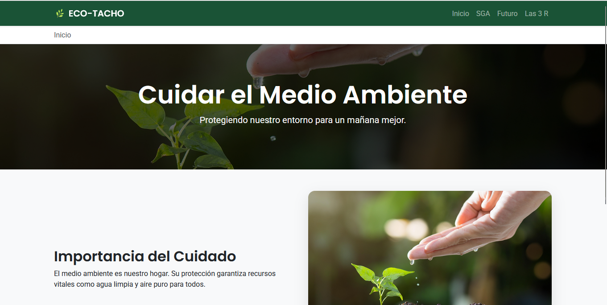
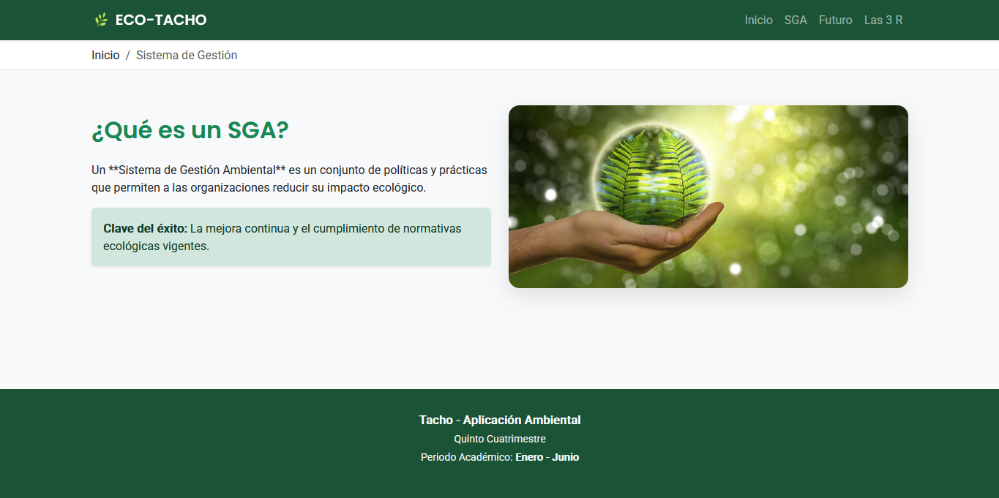
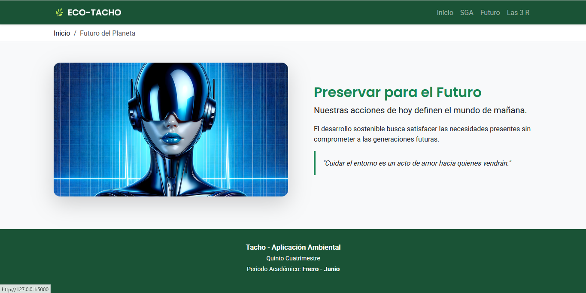
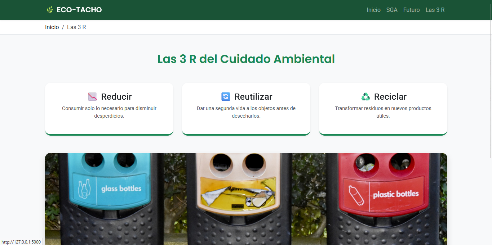

# 🌿 EcoTacho Pro: Plataforma Integral de Gestión y Conciencia Ambiental


## 📖 1. Resumen Ejecutivo del Proyecto

**EcoTacho Pro** es una solución web de vanguardia desarrollada por ** (Josthyn)** para la asignatura **Tacho**. Este proyecto surge como una respuesta tecnológica a la necesidad de centralizar y difundir información crítica sobre sostenibilidad, utilizando una arquitectura de software moderna y escalable para el periodo **Enero - Junio 2026**.

---

## 🛠️ 2. Especificaciones Técnicas y Stack de Desarrollo

El sistema ha sido construido bajo un ecosistema de herramientas de alto rendimiento, enfocado en el desarrollo web con Python y Flask:

### 🐍 Backend (Lógica de Negocio)

- **Python Core:** Lenguaje base utilizado por su robustez en el procesamiento de datos.
- **Flask Framework:** Micro-framework elegido por su flexibilidad en la gestión de rutas y middleware.
- **Jinja2 Templating:** Implementación de herencia de componentes para optimizar el renderizado y reducir la redundancia de código HTML.

### 🎨 Frontend (Interfaz y UX)

- **Bootstrap 5:** Framework de UI utilizado para garantizar un diseño responsivo que se adapta a cualquier dispositivo.
- **Arquitectura Visual:** Enfoque en accesibilidad y legibilidad mediante una paleta de colores coherente con la temática ambiental (Verde Bosque y Menta).
- **Navegación Asistida:** Integración de _Breadcrumbs_ para una experiencia de usuario intuitiva.

---

## 📸 3. Galería de Pruebas de Funcionamiento (Evidencia Visual)

Para validar la integridad técnica del proyecto, se documentan las siguientes 4 pruebas de ejecución real:

<table style="width:100%">
  <tr>
    <td align="center" style="width:50%">
      <h3>🏠 1. Nodo de Inicio (User Experience)</h3>
      
      <p><em>Página principal con Hero Section y mensaje de impacto inmediato.</em></p>
    </td>
    <td align="center" style="width:50%">
      <h3>📊 2. Sistema de Gestión (SGA)</h3>
      
      <p><em>Despliegue de contenidos técnicos sobre normativas ambientales.</em></p>
    </td>
  </tr>
  <tr>
    <td align="center" style="width:50%">
      <h3>🌎 3. Módulo de Futuro</h3>
      
      <p><em>Módulo de reflexión generacional con renderizado de activos PNG de alta resolución.</em></p>
    </td>
    <td align="center" style="width:50%">
      <h3>♻️ 4. Guía Práctica: Las 3 R</h3>
      
      <p><em>Segmentación interactiva mediante componentes tipo Card de Bootstrap.</em></p>
    </td>
  </tr>
</table>

---

## 🏗️ 4. Proceso de Implementación Detallado

### Fase A: Ingeniería de Requerimientos

Se identificaron las necesidades informativas de la materia **Tacho**, priorizando temas como el **SGA** y la **Economía Circular** (Las 3 R).

### Fase B: Arquitectura SOA y Directorios

🌿 EcoTacho Pro: Ingeniería Web para la Sustentabilidad
📖 Resumen Ejecutivo
EcoTacho Pro es una plataforma web educativa de alto impacto diseñada para la concientización ambiental. Desarrollada por Gaby (Josthyn) para la materia Tacho en el Quinto Cuatrimestre, la aplicación integra principios de Arquitectura Orientada a Servicios (SOA) para gestionar información académica y ambiental de forma eficiente. El proyecto destaca por su enfoque en la Experiencia de Usuario (UX) y el Diseño Responsivo.

🛠️ Especificaciones Técnicas (Stack Tecnológico)
El desarrollo se fundamenta en un stack robusto enfocado en la escalabilidad y el rendimiento:

Backend (Python/Flask): Procesamiento de rutas dinámicas y lógica de servidor.

Frontend (HTML5/Jinja2): Uso de herencia de plantillas para optimizar el código y evitar la redundancia.

Diseño (CSS3/Bootstrap 5): Implementación de un sistema de rejilla (Grid) para adaptabilidad total a dispositivos móviles, tablets y escritorio.

Arquitectura: Separación estricta de intereses entre la lógica de negocio (app.py), los recursos estáticos (static/) y las vistas (templates/).

📸 Galería de Pruebas de Funcionamiento (Evidencia Nivel Leyenda)
A continuación, se documenta la interfaz de usuario final mediante las 4 pruebas de validación técnica:

🏠 1. Nodo de Inicio (User Experience)
Presentación impactante con un Hero Section que utiliza transparencia y tipografía profesional para captar la atención del usuario desde el primer segundo.

📊 2. Sistema de Gestión Ambiental (SGA)
Documentación técnica sobre normativas y políticas ambientales. Esta sección demuestra la capacidad de la aplicación para organizar contenido denso de forma legible.

🌎 3. Módulo de Concientización: Futuro
Enfoque en la preservación generacional. Se validó el renderizado de activos complejos (archivos .png de alta resolución) sin comprometer la velocidad de carga.

♻️ 4. Guía Práctica: Las 3 R
Implementación de componentes tipo "Card" de Bootstrap para segmentar la información de Reducir, Reutilizar y Reciclar, facilitando el aprendizaje interactivo.

🏗️ Registro de Implementación Paso a Paso
Fase 1: Entorno y Dependencias
Se inicializó un entorno virtual (venv) para aislar las dependencias del proyecto. Se instaló Flask y se configuró el archivo requirements.txt para asegurar la portabilidad del sistema.

Fase 2: Desarrollo del Core (app.py)
Se programaron las rutas dinámicas asegurando que el Periodo Académico: Enero - Junio se inyectara de forma global en todas las vistas mediante un diccionario de configuración centralizado, garantizando integridad de datos.

Fase 3: Frontend y UX Pro
Se diseñó un archivo de estilos style.css personalizado con variables de color (Verde Bosque y Menta) para fortalecer la identidad visual del proyecto. Se implementaron Breadcrumbs dinámicos para mejorar la navegabilidad del usuario.

Se implementó una estructura organizada para facilitar el mantenimiento a largo plazo:

```text
EcoTacho-Pro/
├── app.py              # Cerebro de la aplicación (Lógica Flask)
├── requirements.txt    # Control de dependencias de software
├── .gitignore          # Archivo de exclusión (Seguridad de Git)
├── static/
│   ├── css/            # Hoja de estilos (style.css)
│   └── images/         # Galería de activos y pruebas (.png, .jpg)
└── templates/          # Vistas procesadas por Jinja2 (base.html, etc.)
```

🚀 Guía de Instalación para Evaluadores
Clona este repositorio: git clone https://github.com/JOSTHONS/EcoTacho-Pro.git

Instala dependencias: pip install -r requirements.txt

Ejecuta el servidor: python app.py

Accede a: http://127.0.0.1:5000

🎓 Información Académica
Desarrollador: (Josthyn Daniel Rodríguez de Jesús).

Institución: Quinto Cuatrimestre.

Proyecto: Tacho - Aplicación Ambiental.

Línea de Interés: Desarrollo Web enfocado en Python, SQL y Flask.
